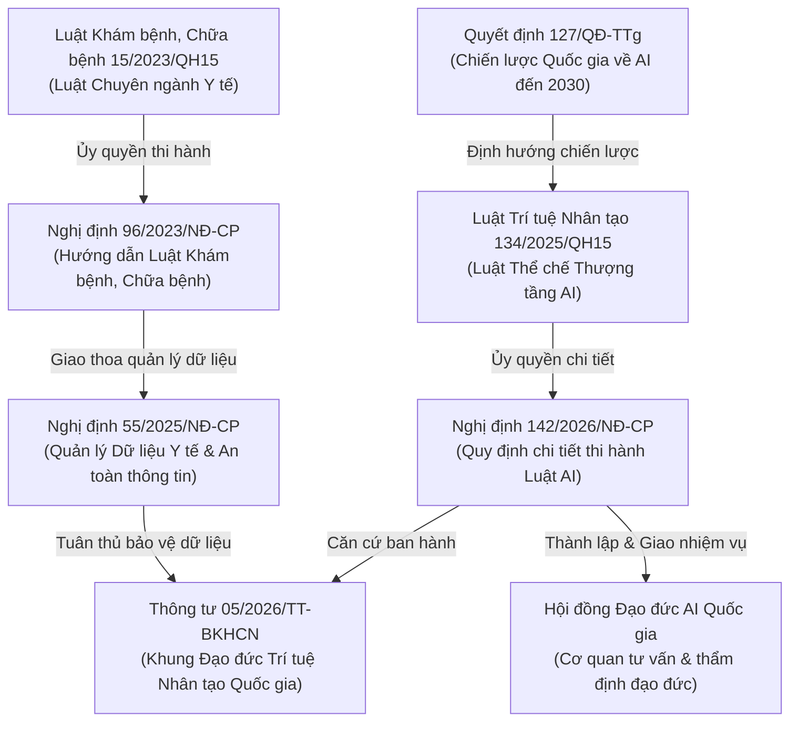

# ĐỒ THỊ QUAN HỆ PHÁP LÝ KHUNG ĐẠO ĐỨC & QUẢN TRỊ AI Y TẾ VIỆT NAM
## (Legal Relation Graph for Vietnam AI Healthcare Ethics & Governance)

**Dự án:** Scoping Review về Đạo đức và Quản trị AI Y tế tại Việt Nam  
**PI / Tác giả:** Đào Trung Thành  
**Người rà soát độc lập:** Lộc Đặng  
**Ngày lập đồ thị:** 01/08/2026  
**Tham chiếu OSF Registration:** DOI [10.17605/OSF.IO/62B8W](https://doi.org/10.17605/OSF.IO/62B8W)  

---

## 1. SƠ ĐỒ QUAN HỆ VĂN BẢN PHÁP LÝ HẠT NHÂN (ANCHOR LEGAL RELATION GRAPH)

---

## 2. BẢNG MÃ HÓA QUAN HỆ THỂ CHẾ VĂN BẢN (STATUTORY RELATION MATRIX)

| Văn bản Gốc (Source Act) | Loại Quan hệ (Relation Type) | Văn bản Đích (Target Act/Entity) | Phạm vi Điều chỉnh liên quan AI Y tế |
| --- | --- | --- | --- |
| **Luật 134/2025/QH15** (Luật AI) | `DELEGATES_TO` | **Nghị định 142/2026/NĐ-CP** | Quy định điều kiện kinh doanh, đánh giá rủi ro thuật toán và trách nhiệm bồi thường. |
| **Nghị định 142/2026/NĐ-CP** | `AUTHORIZES` | **Thông tư 05/2026/TT-BKHCN** | Ban hành Khung Đạo đức AI Quốc gia áp dụng cho các hệ thống AI y tế rủi ro cao. |
| **Nghị định 142/2026/NĐ-CP** | `ESTABLISHES` | **Hội đồng Đạo đức AI Quốc gia** | Quy định chức năng, nhiệm vụ thẩm định đạo đức AI trong các dự án y tế thử nghiệm. |
| **Luật 15/2023/QH15** (Luật KCB) | `GUIDED_BY` | **Nghị định 96/2023/NĐ-CP** | Quy định tiêu chuẩn kỹ thuật khám chữa bệnh từ xa và ứng dụng phần mềm y tế. |
| **Nghị định 96/2023/NĐ-CP** | `INTERSECTS_WITH` | **Nghị định 55/2025/NĐ-CP** | Kiểm soát an toàn dữ liệu sức khỏe, hồ sơ bệnh án điện tử và quyền riêng tư người bệnh. |
| **Quyết định 127/QĐ-TTg** | `STRATEGIC_FRAMEWORK` | **Luật 134/2025/QH15** | Định hướng tổng thể về phát triển hệ sinh thái AI quốc gia và hạ tầng dữ liệu y tế. |

---

## 3. TẠM KẾT VỀ ĐỒ THỊ PHÁP LÝ

Đồ thị Quan hệ Pháp lý đã định hình rõ ràng **hai trục thể chế song song**:
1. **Trục Thể chế AI Quốc gia:** `Quyết định 127/QĐ-TTg` → `Luật 134/2025/QH15` → `Nghị định 142/2026/NĐ-CP` → `Thông tư 05/2026/TT-BKHCN` & `Hội đồng Đạo đức AI Quốc gia`.
2. **Trục Chuyên ngành Y tế & Dữ liệu:** `Luật 15/2023/QH15` → `Nghị định 96/2023/NĐ-CP` ↔ `Nghị định 55/2025/NĐ-CP`.

---
*Tệp đồ thị pháp lý lưu trữ tại `docs/governance/legal-relation-graph-2026-08-01.md`.*
