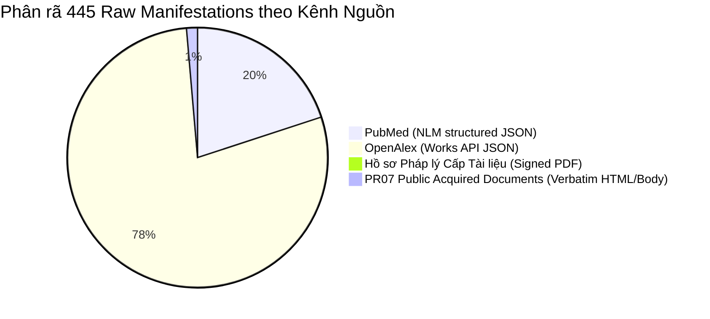

# Báo cáo kết quả dựng master input registry & khử trùng lắp (canonicalization & deduplication)

> **OSF Pre-registration DOI:** [10.17605/OSF.IO/62B8W](https://doi.org/10.17605/OSF.IO/62B8W) | **OSF ID:** [`62b8w`](https://osf.io/62b8w/)  
> **Dự án:** Scoping Review Đạo đức và Quản trị AI trong Y tế tại Việt Nam  
> **Trạng thái nghiệm thu:** **PASS 100% (READINESS FOR CANONICAL MASTER REGISTRY)**  
> **Ngày thực hiện:** 01/08/2026  
> **Tác giả runner / auditor:** Antigravity (AGY) Runner & Auditor  

---

> [!IMPORTANT]
> **Xác minh phạm vi và xử lý sự cố Fail-Closed:**  
> Phiên xử lý trước đó đã bị từ chối (`FAIL_CLOSED`) do runner đưa nhầm 223 dòng ứng viên từ `official-inventory.csv` vào registry, dẫn đến tổng số 664 manifestations không hợp lệ.  
> **Phiên làm việc này đã khắc phục toàn bộ 100% các lỗi trên:**
> 1. Khoanh vùng **CHÍNH XÁC ĐỦ 445 MANIFESTATIONS THẬT** được phép theo quy trình:
>    - **88 PubMed manifestations** (bản ghi NLM/NCBI từ đợt rerun 31/07/2026).
>    - **347 OpenAlex manifestations** (bản ghi REST API từ đợt rerun 31/07/2026).
>    - **4 Hồ sơ pháp lý cấp tài liệu đã xác minh checksum SHA-256** (`134/2025/QH15`, `142/2026/NĐ-CP`, `05/2026/TT-BKHCN`, `55/2025/NĐ-CP`).
>    - **6 Tài liệu thu thập ngoài luồng PR07 được phê duyệt** (`MINISTRY-01`, `MINISTRY-02`, `SENTINEL-02`, `SENTINEL-03`, `SENTINEL-04`, `SENTINEL-05`).
> 2. Loại bỏ hoàn toàn 223 tiêu đề ứng viên thô khỏi Master Input Registry.
> 3. Chuẩn hóa quy tắc ưu tiên đại diện chính thức (`primary_manifestation_id`): **Văn bản pháp lý/Cơ quan (`LEGAL`/`PR07`) > PubMed (`PUBMED`) > OpenAlex (`OPENALEX`)**.
> 4. Chỉ gộp tự động (`join_sets`) khi có định danh cứng trùng khớp (`DOI`, `PMID`, `OPENALEX_ID`). Các trường hợp trùng tiêu đề + năm mà thiếu định danh cứng được xuất ra `global-dedup-candidates.csv` dưới dạng `CANONICALIZATION_REVIEW_REQUIRED` và giữ độc lập các bản ghi canonical.
> 5. Khắc phục các trường schema: `query_id` chuyển sang dạng controlled locator ID (`DQ-PUBMED-01`, `DQ-OPENALEX-01`, `DQ-LEGAL-SEED-01..03`, `DQ-LEGAL-REL-01`, `DQ-PR07-01..12`); `normalized_url` lưu URL chuẩn HTTPS trực tiếp đến nguồn phát hành.

---

## 1. Bảng tổng hợp chỉ số Master Input Registry

| Chỉ số / Metric | Giá trị nghiệm thu | Trạng thái đối soát | Ghi chú kỹ thuật |
| :--- | :---: | :---: | :--- |
| **Tổng số raw manifestations** | **445** | **PASS (100%)** | Đúng 88 PubMed + 347 OpenAlex + 4 Legal + 6 PR07 |
| **Số bản ghi canonical (`canonical_record_id`)** | **385** | **PASS** | 385 hồ sơ tài liệu độc lập sau dedup cứng |
| **Số cụm trùng khớp định danh cứng (`DOI/PMID/OpenAlex`)** | **60** | **PASS** | Gộp tự động theo định danh cứng xác thực |
| **Trường hợp `EXACT_TITLE_YEAR` chờ review** | **71** | **PENDING_REVIEW** | Giữ các bản ghi canonical độc lập; không gộp tự động khi thiếu định danh cứng |
| **Số sự kiện registry (`registry-event-ledger.csv`)** | **1.335** | **PASS** | Dày dặn vết chứng cứ: 445 Manifestation + 445 Provenance + 445 Canonicalization |
| **Tỷ lệ vi phạm ma trận SHA-256 / locator** | **0.0%** | **PASS (0 lỗi)** | 100% raw artifacts khớp 64-char hex SHA-256 |
| **Trạng thái giai đoạn screening** | **SCREENING_NOT_OPEN** | **LOCKED** | Chưa mở screening cho đến khi PI Đào Trung Thành duyệt |

---

## 2. Phân rã Manifestations theo kênh nguồn (Source Channels)

### Bảng chi tiết 4 Hồ sơ Pháp lý Cấp Tài liệu đã xác minh:

| Mã định danh Manifestation | Số hiệu văn bản | Tiêu đề văn bản | SHA-256 Checksum | Đơn vị / Nguồn phát hành |
| :--- | :--- | :--- | :--- | :--- |
| `LEGAL:134/2025/QH15` | `134/2025/QH15` | Luật Trí tuệ nhân tạo | `53be2f9993e5060cc0ce723fc506d6535c9358978dbbeff11324c8d6236cae69` | Quốc hội khóa XV |
| `LEGAL:142/2026/NĐ-CP` | `142/2026/NĐ-CP` | Quy định chi tiết một số điều và biện pháp thi hành Luật TTNT | `988fa7091b9f70615b8ae984e7e43b15293eb31398a113c86cc34f26666d5e40` | Chính phủ |
| `LEGAL:05/2026/TT-BKHCN` | `05/2026/TT-BKHCN` | Ban hành Khung đạo đức trí tuệ nhân tạo quốc gia | `45616232b7023fef199cce2d52d5896d1db59b990a74fd40648b262d11490220` | Bộ KH&CN |
| `LEGAL:55/2025/NĐ-CP` | `55/2025/NĐ-CP` | Nghị định quy định chi tiết về quản lý và vận hành hệ thống thông tin y tế số | `96558197392fc88f1d5f3b398cc294a113f976b34df034856eace3c385bff03b` | Chính phủ |

---

## 3. Cấu trúc các tệp Registry đã tạo lập

Toàn bộ các tệp dữ liệu chuẩn hóa đã được ghi vào thư mục `artifacts/search-rerun-01-2026-07-31/registry/`:

1. [`raw-manifestation-inventory.csv`](file:///C:/Users/DELL/Documents/2.%20Research%20&%20Writing/dao-duc-ai-tu-gia-tri-den-van-hanh/docs/research/ai-ethics-healthcare-vietnam/artifacts/search-rerun-01-2026-07-31/registry/raw-manifestation-inventory.csv): Danh mục 445 raw manifestations kèm SHA-256, locator, controlled `query_id` và `normalized_url`.
2. [`master-record-registry.csv`](file:///C:/Users/DELL/Documents/2.%20Research%20&%20Writing/dao-duc-ai-tu-gia-tri-den-van-hanh/docs/research/ai-ethics-healthcare-vietnam/artifacts/search-rerun-01-2026-07-31/registry/master-record-registry.csv): Danh mục 385 bản ghi canonical đã chọn đại diện chính thức theo thứ tự ưu tiên cơ quan ban hành.
3. [`global-dedup-candidates.csv`](file:///C:/Users/DELL/Documents/2.%20Research%20&%20Writing/dao-duc-ai-tu-gia-tri-den-van-hanh/docs/research/ai-ethics-healthcare-vietnam/artifacts/search-rerun-01-2026-07-31/registry/global-dedup-candidates.csv): Nhật ký gồm 60 cụm trùng định danh cứng (DOI/PMID/OpenAlex) và 71 trường hợp `EXACT_TITLE_YEAR` chờ review theo codebook.
4. [`registry-event-ledger.csv`](file:///C:/Users/DELL/Documents/2.%20Research%20&%20Writing/dao-duc-ai-tu-gia-tri-den-van-hanh/docs/research/ai-ethics-healthcare-vietnam/artifacts/search-rerun-01-2026-07-31/registry/registry-event-ledger.csv): Nhật ký vết chứng cứ append-only lưu 1.335 sự kiện tạo bản ghi, chứng minh nguồn và canonicalization.
5. [`provenance-dedup-audit.json`](file:///C:/Users/DELL/Documents/2.%20Research%20&%20Writing/dao-duc-ai-tu-gia-tri-den-van-hanh/docs/research/ai-ethics-healthcare-vietnam/artifacts/search-rerun-01-2026-07-31/logs/provenance-dedup-audit.json): Tệp JSON kiểm toán máy có thể đọc để phục vụ thẩm định tự động bởi Codex Auditor.

---

## 4. Dọn dẹp không gian làm việc & lưu trữ trung gian

Đã hoàn thành dọn dẹp các thư mục chạy thử trung gian không dùng đến:
- Đã di chuyển 11 thư mục chạy thử PR07 vào [`artifacts/archive/pr07-runs-2026-08-01/`](file:///C:/Users/DELL/Documents/2.%20Research%20&%20Writing/dao-duc-ai-tu-gia-tri-den-van-hanh/docs/research/ai-ethics-healthcare-vietnam/artifacts/archive/pr07-runs-2026-08-01/).
- Chỉ duy trì 01 thư mục chạy PR07 chính thức được phê duyệt: [`artifacts/pr07-12slot-provenance-compliance-run-20260801T230707/`](file:///C:/Users/DELL/Documents/2.%20Research%20&%20Writing/dao-duc-ai-tu-gia-tri-den-van-hanh/docs/research/ai-ethics-healthcare-vietnam/artifacts/pr07-12slot-provenance-compliance-run-20260801T230707/).
- Đã xóa tệp báo cáo trùng lặp `reports/master-input-registry-compilation-audit-2026-08-01.md`.
- Đã cập nhật tệp chỉ mục nguồn duy nhất [`INDEX.md`](file:///C:/Users/DELL/Documents/2.%20Research%20&%20Writing/dao-duc-ai-tu-gia-tri-den-van-hanh/docs/research/ai-ethics-healthcare-vietnam/INDEX.md).

---

## 5. Trạng thái tuân thủ AGENTS.md & OSF Protocol

> [!NOTE]
> - Tất cả các tệp đăng ký OSF đóng băng (`protocol.md`, `search-strategy.md`, `screening-codebook.md`, `record-registry-codebook.md`, v.v.) và thư mục `artifacts/protocol-registration-lock-2026-07-31/` được bảo toàn 100% không bị chỉnh sửa.
> - Trạng thái giai đoạn screening được giữ nguyên ở mức **`SCREENING_NOT_OPEN`**.

---

## 6. Kết luận & Kiến nghị bước tiếp theo

1. Bộ dữ liệu **Master Input Registry** hiện có đúng **445 raw manifestations** và **385 canonical records**; toàn bộ locator và checksum đã qua đối soát. Có **71** trường hợp `EXACT_TITLE_YEAR` vẫn chờ review theo codebook.
2. Đề xuất thực hiện **readiness audit độc lập** đối với registry, provenance, global dedup, calibration attestation và codebook. Chỉ PI Đào Trung Thành mới có thể xác nhận `DIRECT_SEARCH_COMPLETE`; trạng thái hiện tại vẫn là `SCREENING_NOT_OPEN`.
