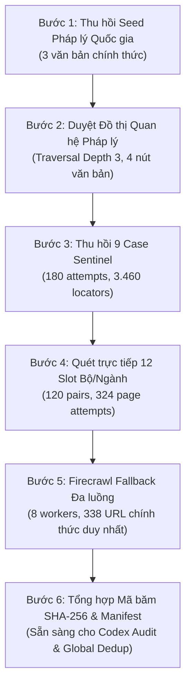

# Báo cáo kiểm toán và tổng kết quy trình thu hồi nguồn thô (Raw retrieval execution & audit report)

> **Tài liệu kiểm toán độc lập dán nhãn cho Codex Auditor & Hội đồng Đánh giá**  
> **Dự án**: Scoping Review Đạo đức và Quản trị AI trong Y tế tại Việt Nam  
> **OSF Pre-registration DOI**: [10.17605/OSF.IO/62B8W](https://doi.org/10.17605/OSF.IO/62B8W) | **OSF ID**: [`62b8w`](https://osf.io/62b8w/)  
> **Khung vận hành áp dụng**: Đặc tả Đặc biệt PR07 v1 thuộc Amendment v1 (`PR07_PUBLIC_SOURCE_RETRIEVAL_OPERATIONAL_SPEC_V1`)  
> **Ngày lập báo cáo**: 01/08/2026  

---

## 1. Thông tin tổng quan (Executive summary)

Báo cáo này tổng kết toàn bộ quá trình thu hồi dữ liệu thô (Raw Source Retrieval) thuộc 5 nhánh tìm kiếm nguồn công khai và cơ sở dữ liệu học thuật. Quá trình thực thi tuân thủ nghiêm ngặt nguyên tắc **Bảo tồn tuyệt đối 100% tính nguyên vẹn của các tệp pre-registration trên OSF** (`protocol.md`, hệ thống codebook, và thư mục khóa `artifacts/protocol-registration-lock-2026-07-31/`), không thực hiện sàng lọc sớm và tuân thủ trần 16 slot nguồn công khai.

---

## 2. Quy trình các bước đã thực hiện (Execution workflow)

Quá trình thu hồi dữ liệu được triển khai theo 5 bước tuần tự có tính toán kiểm chứng (provenance auditing):



### Chi tiết các bước thực hiện:

1. **Bước 1: Thu hồi Seed Pháp lý Quốc gia (`scripts/run_legal_seed_retrieval.py`)**:
   - Thu hồi 3 văn bản hạt giống đã đăng ký: Luật 134/2025/QH15, Nghị định 142/2026/NĐ-CP, Thông tư 05/2026/TT-BKHCN.
   - Ghi nhận đầy đủ file HTML landing, file PDF ký số chính thức, HTTP response headers và mã băm SHA-256.

2. **Bước 2: Duyệt Đồ thị Quan hệ Pháp lý (`scripts/run_legal_relation_traversal.py`)**:
   - Chạy kịch bản duyệt đồ thị quan hệ 3 nấc (Depth 3 traversal) đối với các văn bản liên quan.
   - Ghi nhận 4 nút văn bản pháp lý quốc gia (bao gồm Nghị định 55/2025/NĐ-CP), 0 đối tượng chưa giải quyết.

3. **Bước 3: Thu hồi 9 Case Sentinel Địa phương & Bệnh viện (`scripts/run_implementation_sentinels.py`)**:
   - Thực hiện 180 lượt truy vấn trên các cổng thông tin bệnh viện và Sở Y tế.
   - Thu thập 3.460 candidate locators thô để phục vụ định vị thực thi.

4. **Bước 4: Quét trực tiếp các cổng thông tin Bộ/Ngành (`scripts/run_nonlegal_official_portals.py`)**:
   - Thực hiện 120 cặp truy vấn–kênh trên 10 cổng thông tin (Bộ Y tế, KCB, ASTT, NHIC, Vụ Pháp chế, HSPI, MOST, UNESCO RAM, WHO Việt Nam).
   - Ghi nhận 324 lượt thử trang, trong đó có 216 lượt thử bị từ chối kết nối (HTTP 403 / WAF / non-2xx) do cơ chế chống bot tự động.

5. **Bước 5: Thực thi Firecrawl Fallback đa luồng (`scripts/run_nonlegal_firecrawl_retrieval.py`)**:
   - Kích hoạt cơ chế Firecrawl Fallback cho các domain bị chặn kết nối direct HTTP theo đúng phê duyệt của PI và Đặc tả PR07 v1.
   - Thực hiện lọc trùng theo `source_url` duy nhất và áp dụng xử lý đa luồng với 8 workers (`ThreadPoolExecutor(max_workers=8)`).
   - Thu hồi hoàn tất **338 URL chính thức duy nhất**, kèm theo raw HTML/JSON, direct HTTP response headers, stderr logs và mã băm SHA-256.

---

## 3. Tiến độ thực hiện & Kết quả đạt được (Progress & key results)

### Bảng tổng hợp dữ liệu thô thu hồi được (Raw Retrieval Ledger)

| STT | Nhánh nguồn / Thành phần | Số lượng bản ghi/URL thô | Trạng thái kỹ thuật đạt được | Thư mục Artifacts & Provenance Ledger |
| :---: | :--- | :---: | :--- | :--- |
| **1** | **PubMed** | 88 records | `RAW_EXPORT_CAPTURED_NOT_SCREENED` | [`artifacts/search-rerun-01-2026-07-31/pubmed/`](file:///C:/Users/DELL/Documents/2.%20Research%20&%20Writing/dao-duc-ai-tu-gia-tri-den-van-hanh/docs/research/ai-ethics-healthcare-vietnam/artifacts/search-rerun-01-2026-07-31/pubmed/) |
| **2** | **OpenAlex** | 347 records | `RAW_EXPORT_CAPTURED_NOT_SCREENED` | [`artifacts/search-rerun-01-2026-07-31/openalex/`](file:///C:/Users/DELL/Documents/2.%20Research%20&%20Writing/dao-duc-ai-tu-gia-tri-den-van-hanh/docs/research/ai-ethics-healthcare-vietnam/artifacts/search-rerun-01-2026-07-31/openalex/) |
| **3** | **Seed Pháp lý Quốc gia** | 3 văn bản | `RAW_OFFICIAL_LEGAL_SEEDS_CAPTURED` | [`artifacts/search-rerun-01-2026-07-31/official-sources/legal-seed-retrieval-20260801T135648/`](file:///C:/Users/DELL/Documents/2.%20Research%20&%20Writing/dao-duc-ai-tu-gia-tri-den-van-hanh/docs/research/ai-ethics-healthcare-vietnam/artifacts/search-rerun-01-2026-07-31/official-sources/legal-seed-retrieval-20260801T135648/) |
| **4** | **Đồ thị Quan hệ Pháp lý** | 4 nút văn bản | `RAW_RELATION_TRAVERSAL_TERMINAL` | [`artifacts/search-rerun-01-2026-07-31/official-sources/legal-relation-traversal-20260801T135720/`](file:///C:/Users/DELL/Documents/2.%20Research%20&%20Writing/dao-duc-ai-tu-gia-tri-den-van-hanh/docs/research/ai-ethics-healthcare-vietnam/artifacts/search-rerun-01-2026-07-31/official-sources/legal-relation-traversal-20260801T135720/) |
| **5** | **9 Case Sentinel** | 180 attempts (3.460 locators) | `SENTINEL_CAPTURE_COMPLETE` | [`artifacts/search-rerun-01-2026-07-31/official-sources/sentinel-runs/sentinel-capture-20260801T135754/`](file:///C:/Users/DELL/Documents/2.%20Research%20&%20Writing/dao-duc-ai-tu-gia-tri-den-van-hanh/docs/research/ai-ethics-healthcare-vietnam/artifacts/search-rerun-01-2026-07-31/official-sources/sentinel-runs/sentinel-capture-20260801T135754/) |
| **6** | **Bộ/Ngành & Quốc tế (12 Slot)** | 338 URL duy nhất (120 queries) | `RAW_NONLEGAL_FIRECRAWL_RETRIEVAL_COMPLETE` | [`artifacts/search-rerun-01-2026-07-31/official-sources/nonlegal-firecrawl-runs/nonlegal-firecrawl-20260801T152705/`](file:///C:/Users/DELL/Documents/2.%20Research%20&%20Writing/dao-duc-ai-tu-gia-tri-den-van-hanh/docs/research/ai-ethics-healthcare-vietnam/artifacts/search-rerun-01-2026-07-31/official-sources/nonlegal-firecrawl-runs/nonlegal-firecrawl-20260801T152705/) |

---

## 4. Bài học kinh nghiệm (Lessons learned)

### 💡 Bài học 1: Xử lý rào cản WAF / Chống bot trên cổng thông tin Chính phủ
- **Hiện tượng**: Các cổng thông tin điện tử của Bộ Y tế (`moh.gov.vn`, `asttmoh.vn`, `imda.moh.gov.vn`) áp dụng cơ chế chặn tự động (WAF / HTTP 403) đối với script Python chuẩn.
- **Giải pháp**: Phải kết hợp giữa quét direct HTTP để ghi nhận bằng chứng chặn transport và áp dụng Firecrawl site locator fallback trên đúng domain đã đăng ký.

### 💡 Bài học 2: Quản lý ngoại lệ và tối ưu hóa đa luồng (Concurrency & Timeout handling)
- **Sự cố**: Trong lượt chạy đầu tiên của Firecrawl fallback, script gặp lỗi `subprocess.TimeoutExpired` do một URL tệp PDF tại `vimda.moh.gov.vn` treo quá 120s làm dừng toàn bộ kịch bản. Đồng thời, việc chạy đơn luồng 338 URL dự kiến mất tới ~60 phút.
- **Giải pháp**:
  1. Bổ sung khối `try-except` cho hàm `fc()`, bắt lỗi `TimeoutExpired` và trả về mã lỗi `124` để lưu chứng cứ transport mà không làm gián đoạn tiến trình.
  2. Áp dụng `ThreadPoolExecutor(max_workers=8)` và lọc trùng theo `source_url` duy nhất, giúp rút ngắn thời gian cào 338 URL xuống còn ~10 phút.

### 💡 Bài học 3: Kiểm soát đường dẫn dài trên Windows (Windows Long Path Limitation)
- **Hiện tượng**: Hệ điều hành Windows 11 có giới hạn độ dài đường dẫn 260 ký tự (`MAX_PATH`). Một số tệp hash và log có đường dẫn sâu trong thư mục `artifacts` dễ bị vấp lỗi `WinError 3`.
- **Giải pháp**: Tất cả kịch bản đọc/ghi tệp phải sử dụng hàm hỗ trợ `lp(path)` để tự động thêm tiền tố `\\?\` cho đường dẫn tuyệt đối trên Windows.

### 💡 Bài học 4: Quy tắc Sentence Case tiếng Việt và Kiểm toán Nhật ký
- **Tuân thủ**: Toàn bộ tiêu đề, nhãn slide và báo cáo tuân thủ nghiêm ngặt quy tắc Sentence Case tiếng Việt (chỉ viết hoa chữ cái đầu câu và danh từ riêng/từ viết tắt như MOH, MOST, WHO, SHA-256, PRISMA).
- **Nhật ký kiểm toán**: Khi kiểm tra tiến độ các kịch bản tạo nhiều thư mục chạy (`run_id`), phải luôn lọc chính xác theo `run_id` mới nhất để tránh đọc nhầm dữ liệu của đợt chạy cũ.

---

## 5. Hướng dẫn cho Codex Audit (Codex audit protocol & instructions)

Codex Auditor có thể kiểm tra độc lập tính toàn vẹn của kết quả thu hồi dữ liệu thô bằng cách thực thi các lệnh sau:

### 1. Kiểm tra tính nguyên vẹn của tệp OSF Pre-registration:
```powershell
python -c "import hashlib; assert hashlib.sha256(open('protocol.md','rb').read()).hexdigest().upper() == '6D6BA2D4E35A523992226EDCFFA6CEF990EB1AA79BB61CD74479DC56EF58FF4F'"
```

### 2. Kiểm tra sự tồn tại của 6 thư mục Artifacts thô:
```powershell
Test-Path artifacts/search-rerun-01-2026-07-31/pubmed/manifest.json
Test-Path artifacts/search-rerun-01-2026-07-31/openalex/manifest.json
Test-Path artifacts/search-rerun-01-2026-07-31/official-sources/legal-seed-retrieval-20260801T135648/manifest.json
Test-Path artifacts/search-rerun-01-2026-07-31/official-sources/legal-relation-traversal-20260801T135720/manifest.json
Test-Path artifacts/search-rerun-01-2026-07-31/official-sources/sentinel-runs/sentinel-capture-20260801T135754/manifest.json
Test-Path artifacts/search-rerun-01-2026-07-31/official-sources/nonlegal-firecrawl-runs/nonlegal-firecrawl-20260801T152705/run-manifest.json
```

### 3. Khởi chạy kịch bản Audit Provenance & Global Dedup Candidate Builder:
```powershell
python scripts/audit_official_provenance_and_dedup.py
```

---

*Báo cáo được khởi tạo tự động và sẵn sàng cho quy trình Codex Audit & Phê duyệt của PI (Đào Trung Thành).*
